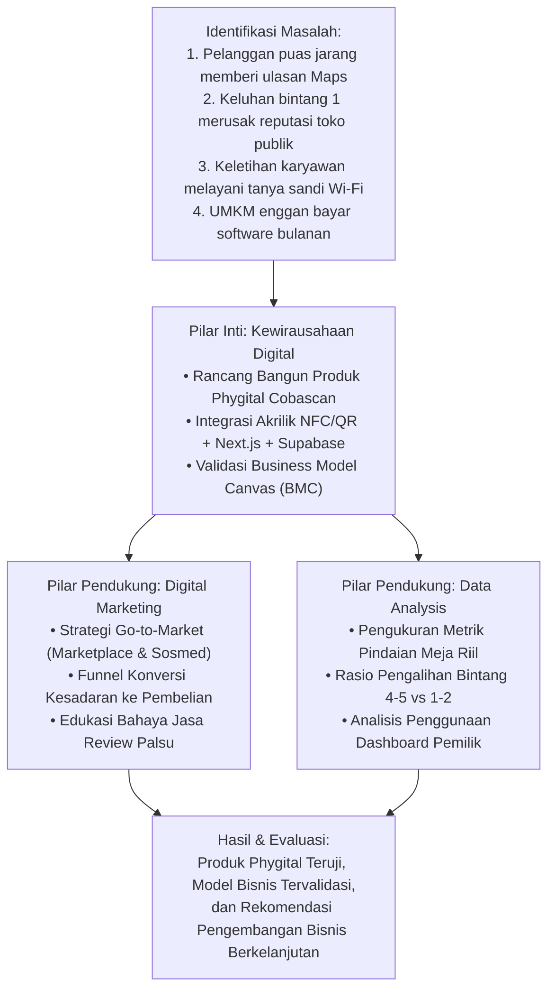

# 03 — Usulan Judul, Fokus Akademis, dan Metodologi Tugas Akhir

**Program Studi:** S1 Bisnis Digital  
**Fakultas:** Fakultas Ekonomi dan Bisnis, Universitas Ibn Khaldun (UIKA) Bogor  
**Jenis Tugas Akhir:** Berbasis Proyek (*Project-Based Thesis*)  
**Bidang Peminatan:** Kewirausahaan Digital (*Digital Entrepreneurship*) dengan Integrasi *Digital Marketing* dan *Data Analysis*  

---

## 1. Usulan Alternatif Judul Tugas Akhir

Berdasarkan pedoman penulisan tugas akhir berbasis proyek di Program Studi S1 Bisnis Digital UIKA Bogor dan **pilihan fokus pada Pemasaran Digital (Sudut Pandang A: B2B Digital Marketing & Funnel Konversi)**, diajukan judul utama berikut:

### 🌟 Pilihan Utama — Fokus Pemasaran Digital (Telah Disusun di Dokumen 07)
> **"PERANCANGAN DAN EVALUASI STRATEGI DIGITAL MARKETING BERBASIS FUNNEL KONVERSI UNTUK AKUISISI MITRA UMKM PADA PRODUK PHYGITAL COBASCAN"**

- **Dokumen Naskah Proposal Lengkap**: Tersedia di [`07-proposal-tugas-akhir-digital-marketing.md`](file:///Users/macbookair2020m1/Documents/smart%20wifi/documentation/tugas-akhir/07-proposal-tugas-akhir-digital-marketing.md).
- **Alasan Pemilihan**:
  - Menempatkan **Pemasaran Digital (*Digital Marketing*) sebagai pilar inti tugas akhir**, sementara produk fisik dan web Cobascan berfungsi sebagai aset produk riil (*product asset*).
  - Mengkaji perancangan alur konversi (*marketing funnel* AIDA): mulai dari konten video pendek edukasi di media sosial (TikTok/Reels), periklanan berbayar Meta Ads, optimasi landing page [cobascan.my.id](https://cobascan.my.id), hingga akuisisi transaksi di marketplace/WhatsApp.
  - Sangat aplikatif, relevan dengan profil lulusan S1 Bisnis Digital, dan memiliki data terukur (CTR, CPC, CAC, conversion rate).

---

### Alternatif 2 (Fokus Inovasi Produk & Validasi Pasar Startup)
> **"PENGEMBANGAN DAN VALIDASI PRODUK PHYGITAL 'COBASCAN' SEBAGAI SOLUSI OPTIMASI REPUTASI GOOGLE REVIEW DAN MANAJEMEN WI-FI PADA UMKM KULINER DI INDONESIA"**
- **Dokumen Naskah Proposal Lengkap**: Tersedia di [`05-draft-tugas-akhir.md`](file:///Users/macbookair2020m1/Documents/smart%20wifi/documentation/tugas-akhir/05-draft-tugas-akhir.md).

---

### Alternatif 3 (Fokus Metodologi Lean Startup & Eksperimentasi Produk)
> **"PENERAPAN METODOLOGI LEAN STARTUP DALAM PENGEMBANGAN DAN VALIDASI PASAR PRODUK SMART ACRYLIC 'COBASCAN' BAGI PELAKU USAHA F&B"**

- **Alasan Pemilihan**:
  - Menekankan siklus akademis *Build–Measure–Learn* dan pengujian *Minimum Viable Product* (MVP).
  - Cocok jika dosen pembimbing menghendaki penekanan kuat pada tahapan validasi pasar dan iterasi berbasis umpan balik pengguna.

---

### Alternatif 3 (Fokus Transformasi Digital Touchpoint)
> **"RANCANG BANGUN DAN VALIDASI MODEL BISNIS PLATFORM PHYGITAL 'COBASCAN' DALAM MENDORONG DIGITALISASI TITIK INTERAKSI MEJA PADA SEKTOR F&B DAN HOSPITALITY"**

- **Alasan Pemilihan**:
  - Berfokus pada konsep *touchpoint digitization* (mengubah meja pasif menjadi saluran interaksi digital aktif).
  - Menitikberatkan pada pengujian Business Model Canvas (BMC) dan efektivitas saluran distribusi.

---

## 2. Integrasi Tiga Pilar Keilmuan Bisnis Digital

Sesuai kurikulum S1 Bisnis Digital, tugas akhir ini memadukan tiga pilar kompetensi utama:

```
                      ┌─────────────────────────────────────────┐
                      │               PILAR INTI                │
                      │         Kewirausahaan Digital           │
                      │     (Digital Entrepreneurship)          │
                      │                                         │
                      │ • Identifikasi masalah nyata UMKM       │
                      │ • Perancangan produk phygital (MVP)     │
                      │ • Penerapan Business Model Canvas (BMC) │
                      │ • Validasi product-market fit           │
                      └────────────────────┬────────────────────┘
                                           │
                    ┌──────────────────────┴──────────────────────┐
                    ▼                                             ▼
  ┌───────────────────────────────────┐         ┌───────────────────────────────────┐
  │         PILAR PENDUKUNG 1         │         │         PILAR PENDUKUNG 2         │
  │         Digital Marketing         │         │           Data Analysis           │
  │                                   │         │                                   │
  │ • Strategi Go-to-Market (GTM)     │         │ • Analisis Funnel Konversi Pindai │
  │ • Pemasaran Konten (Short-form)   │         │ • Analisis Retensi & Pindaian     │
  │ • Iklan Berbayar Meta Ads         │         │ • Evaluasi Metrik AARRR           │
  │ • Optimasi Conversion Rate (CRO)  │         │ • Pengambilan Keputusan Iterasi   │
  └───────────────────────────────────┘         └───────────────────────────────────┘
```

---

## 3. Rumusan Masalah dan Tujuan Penelitian

### 3.1. Rumusan Masalah
1. Bagaimana merancang dan membangun produk *phygital* stand akrilik pintar “Cobascan” yang mengintegrasikan QR Code, chip NFC, dan platform web Next.js?
2. Bagaimana merumuskan dan menguji model bisnis (*Business Model Canvas*) Cobascan dengan skema *one-time purchase* hardware tanpa biaya langganan bulanan bagi UMKM?
3. Bagaimana merancang strategi pemasaran digital (*go-to-market*) untuk mengakuisisi mitra bisnis fisik dan memvalidasi kemauan membayar (*willingness to pay*) pemilik usaha?
4. Bagaimana menganalisis data aktivitas pindaian (*scan metrics*) dan interaksi pengunjung untuk mengevaluasi efektivitas produk serta mengarahkan iterasi fitur berikutnya?

### 3.2. Tujuan Penelitian
1. Menghasilkan produk *phygital* Cobascan yang fungsional dan siap pakai, mencakup perangkat fisik akrilik, antarmuka pindaian tamu, serta dashboard pemilik usaha.
2. Memvalidasi model bisnis Cobascan melalui pemetaan Business Model Canvas dan evaluasi penerimaan harga di pasar UMKM.
3. Merumuskan dan mengeksekusi strategi pemasaran digital multi-kanal (marketplace, konten media sosial, dan penjualan langsung) untuk akuisisi mitra.
4. Menganalisis metrik performa produk (jumlah pindaian, rasio konversi ulasan, dan masukan tersaring) sebagai landasan pengambilan keputusan perbaikan produk.

---

## 4. Kerangka Berpikir Penelitian



---

## 5. Metodologi Penelitian dan Pengembangan Produk

### 5.1. Pendekatan Penelitian
Pendekatan yang digunakan adalah **Kombinasi Rekayasa Produk (*Product Development*) dan Studi Kasus Validasi Bisnis (*Business Case Study*)**.

### 5.2. Siklus Pengembangan Lean Startup (*Build–Measure–Learn*)
1. **Fase 1: Build (Membangun MVP)**:
   - Analisis kebutuhan fungsional (PRD) dan kebutuhan pasar (MRD).
   - Perancangan arsitektur perangkat keras (stand akrilik + NTAG213) dan perangkat lunak (Next.js 14, Tailwind CSS, Supabase PostgreSQL, Drizzle ORM).
   - Implementasi modul autentikasi WhatsApp + PIN, smart rating filter, dan manajemen multi-perangkat.
2. **Fase 2: Measure (Pengukuran dan Pengumpulan Data)**:
   - Peluncuran versi operasional (*running deployment*) pada domain [cobascan.my.id](https://cobascan.my.id).
   - Pencatatan log aktivitas pindaian secara kuantitatif melalui tabel `scan_logs`.
   - Pengumpulan data kualitatif berupa umpan balik mitra pemilik kafe dan pengujian langsung pengunjung.
3. **Fase 3: Learn (Pembelajaran dan Iterasi)**:
   - Evaluasi kesesuaian antara ekspektasi pengguna dengan performa sistem (misal: penyempurnaan tampilan laptop/desktop dari sempit menjadi `max-w-5xl`).
   - Identifikasi celah bisnis untuk menyempurnakan strategi penetapan harga dan kemasan bundling.

### 5.3. Rencana Jadwal Pelaksanaan Tugas Akhir

| No | Tahapan Pelaksanaan | Perkiraan Alokasi Waktu | Output yang Dihasilkan |
| :-: | :--- | :---: | :--- |
| 1 | Penyusunan & Seminar Proposal | Bulan 1 | Dokumen Proposal Tugas Akhir Disetujui |
| 2 | Penyempurnaan Produk & Batch Pilot | Bulan 2 | Unit Fisik Akrilik & Platform Web Stabil |
| 3 | Uji Coba Lapangan di Kafe Mitra | Bulan 3 | Data Log Pindaian & Umpan Balik Mitra |
| 4 | Eksekusi Pemasaran Digital | Bulan 4 | Metrik Kampanye Digital & Penjualan Unit |
| 5 | Analisis Data & Evaluasi Model Bisnis | Bulan 5 | Rekap Analisis Metrik & Validasi BMC |
| 6 | Penyusunan Naskah Lengkap & Sidang | Bulan 6 | Naskah Skripsi Akhir & Persiapan Sidang |
