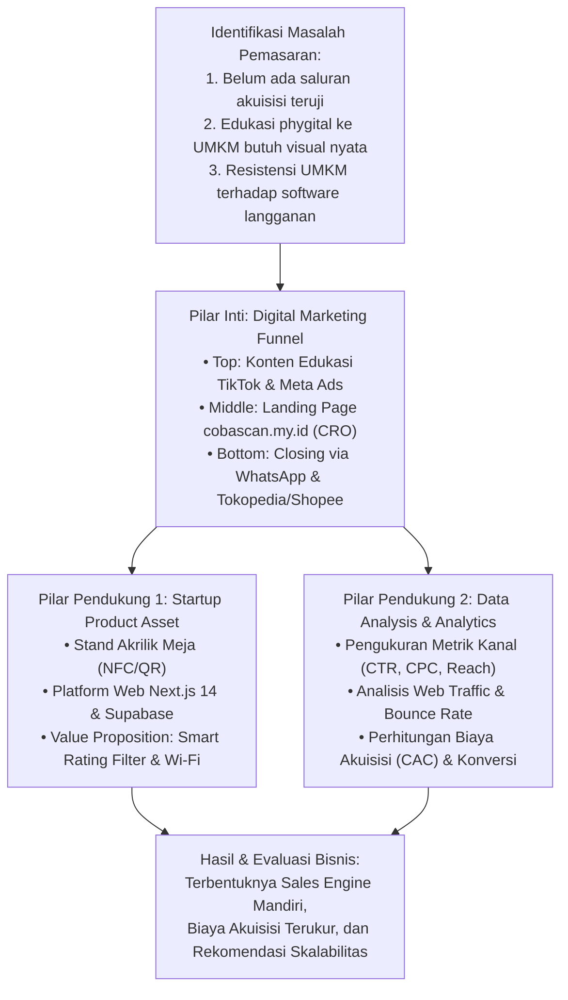

# PROPOSAL TUGAS AKHIR
### (BERBASIS PROJECT / PROJECT-BASED)

---

# PERANCANGAN DAN EVALUASI STRATEGI DIGITAL MARKETING BERBASIS FUNNEL KONVERSI UNTUK AKUISISI MITRA UMKM PADA PRODUK PHYGITAL COBASCAN

**Diajukan sebagai Proposal Tugas Akhir Berbasis Project**  
**Program Studi S1 Bisnis Digital**  

<br/><br/>

**Disusun oleh:**  
**[NAMA MAHASISWA]**  
**NPM: [NPM MAHASISWA]**  

<br/><br/>

### PROGRAM STUDI BISNIS DIGITAL
### FAKULTAS EKONOMI DAN BISNIS
### UNIVERSITAS IBN KHALDUN (UIKA) BOGOR
### 2026

---

## LEMBAR PENGESAHAN

**Proposal Tugas Akhir berbasis project dengan judul:**  
*“Perancangan dan Evaluasi Strategi Digital Marketing Berbasis Funnel Konversi untuk Akuisisi Mitra UMKM pada Produk Phygital Cobascan”*  

yang disusun oleh:

| Keterangan | Data |
| :--- | :--- |
| **Nama** | [NAMA MAHASISWA] |
| **NPM** | [NPM MAHASISWA] |
| **Program Studi** | S1 Bisnis Digital |
| **Fokus Tugas Akhir** | **Pemasaran Digital (*Digital Marketing*)** — dengan integrasi Kewirausahaan Digital (*Startup*) dan Analisis Data (*Data Analysis*) |
| **Jenis Tugas Akhir** | Berbasis Project (Implementasi dan Evaluasi Kampanye Pemasaran Digital pada Produk Riil) |

telah diperiksa dan disetujui untuk diajukan dalam pelaksanaan Tugas Akhir pada Program Studi S1 Bisnis Digital, Universitas Ibn Khaldun (UIKA) Bogor.

<br/>

Bogor, ......................... 2026

| Menyetujui, Dosen Pembimbing | Mengetahui, Ketua Program Studi Bisnis Digital |
| :---: | :---: |
| <br/><br/><br/>(......................................................) NIDN. ......................... | <br/><br/><br/>(......................................................) NIDN. ......................... |

---

## DAFTAR ISI

- LEMBAR PENGESAHAN
- DAFTAR ISI
- **BAB I PENDAHULUAN**
  - 1.1 Latar Belakang
  - 1.2 Rumusan Masalah
  - 1.3 Tujuan Penelitian
  - 1.4 Manfaat Penelitian
  - 1.5 Ruang Lingkup dan Batasan
- **BAB II TINJAUAN PUSTAKA**
  - 2.1 Pemasaran Digital (Digital Marketing) B2B untuk UMKM
  - 2.2 Model Funnel Konversi Pemasaran (AIDA & Inbound Marketing)
  - 2.3 Pemasaran Konten (Content Marketing) dan Media Sosial Video Pendek
  - 2.4 Pemasaran Berbayar (Paid Advertising & Meta Ads)
  - 2.5 Optimasi Tingkat Konversi (Conversion Rate Optimization / CRO)
  - 2.6 Metrik Kinerja Pemasaran Digital (CTR, CPC, CAC, ROAS)
  - 2.7 Karakteristik Produk Phygital Cobascan sebagai Objek Pemasaran
  - 2.8 Kajian Penelitian Terdahulu
- **BAB III METODOLOGI DAN RANCANGAN PELAKSANAAN**
  - 3.1 Jenis dan Pendekatan Penelitian
  - 3.2 Kerangka Berpikir Pemasaran Digital
  - 3.3 Tahapan Pelaksanaan Strategi Pemasaran
  - 3.4 Arsitektur Ekosistem dan Kanal Pemasaran Digital
  - 3.5 Gambaran Produk dan Proposisi Nilai yang Dipasarkan
  - 3.6 Integrasi Tiga Pilar Bisnis Digital
  - 3.7 Teknik Pengumpulan dan Analisis Data Metrik
  - 3.8 Indikator Keberhasilan Kampanye Pemasaran
  - 3.9 Jadwal Pelaksanaan Proyek
- DAFTAR PUSTAKA

---

# BAB I
# PENDAHULUAN

### 1.1 Latar Belakang

Pesatnya perkembangan teknologi informasi telah menggeser paradigma pemasaran dari saluran konvensional menuju strategi pemasaran digital (*digital marketing*). Di Indonesia, Usaha Mikro, Kecil, dan Menengah (UMKM)—khususnya yang bergerak di sektor kuliner (*Food and Beverage* / F&B) seperti kafe, kedai kopi, dan restoran—menjadi sektor yang paling terdampak oleh dinamika visibilitas daring. Keberhasilan bisnis fisik pada era pasca-pandemi sangat dipengaruhi oleh reputasi digital di Google Maps (*Google Business Profile*), di mana ulasan dan rating bintang menjadi penentu utama minat kunjungan konsumen baru.

Namun demikian, memasarkan produk teknologi kepada pelaku UMKM di Indonesia menghadirkan tantangan pemasaran B2B (*Business-to-Business*) yang khas. Sebagian besar pemilik usaha fisik memiliki resistensi tinggi terhadap penawaran perangkat lunak berbasis langganan bulanan (*subscription model*), proses registrasi yang rumit, atau solusi yang terasa abstrak. Untuk menjawab kebutuhan tersebut, penulis mengembangkan **Cobascan** ([https://cobascan.my.id](https://cobascan.my.id)), yaitu sebuah inovasi produk *phygital* (penggabungan fisik dan digital) berupa stand akrilik pintar di atas meja yang terhubung dengan chip NFC (*Near Field Communication*) dan QR Code dinamis. Cobascan menyelesaikan masalah rendahnya partisipasi ulasan Google Maps melalui mekanisme cerdas: memfasilitasi pengunjung memilih rating 1–5 bintang yang langsung diarahkan secara transparan ke Google Review resmi (100% patuh terhadap kebijakan Google / ToS Compliant), serta menukarnya dengan akses sandi Wi-Fi otomatis.

Meskipun produk Cobascan telah selesai dibangun secara fungsional (*running product*) dengan sistem web berbasis Next.js 14 dan Supabase PostgreSQL, keberhasilan produk teknologi pada akhirnya ditentukan oleh **kemampuan menjangkau pasar dan mengonversi calon pelanggan (*go-to-market execution*)**. Produk yang unggul secara teknis tidak akan memberikan dampak ekonomi apabila tidak didukung oleh strategi pemasaran digital yang tepat sasaran untuk meyakinkan para pemilik kafe dan UMKM.

Tantangan utama yang dihadapi Cobascan saat ini adalah:
1. **Rendahnya Kesadaran Pasar (*Low Market Awareness*)**: Banyak pemilik usaha fisik yang belum menyadari bahwa ulasan buruk di Google Maps dapat dicegah dan belum memahami konsep stand akrilik pintar *phygital*.
2. **Edukasi Nilai Investasi**: Perlunya menyampaikan proposisi nilai bahwa membeli stand Cobascan dengan skema sekali bayar (*one-time purchase*) jauh lebih murah dan aman dibandingkan risiko kehilangan pelanggan akibat rating buruk atau membayar jasa ulasan palsu yang berisiko dihapus Google.
3. **Optimasi Funnel Konversi**: Perlunya merancang alur perjalanan calon pembeli yang mulus—mulai dari melihat konten video pendek di media sosial, mengunjungi halaman penawaran (*landing page*) [cobascan.my.id](https://cobascan.my.id), berkonsultasi via WhatsApp, hingga melakukan transaksi pembelian unit stand akrilik.

Berdasarkan urgensi tersebut, Tugas Akhir ini mengambil fokus utama pada **Pemasaran Digital (*Digital Marketing*)** dengan objek studi kasus produk riil Cobascan. Penelitian ini membedah bagaimana merancang strategi pemasaran multi-saluran berbasis kerangka *marketing funnel* (AIDA), mengeksekusi kampanye konten edukatif dan iklan berbayar (Meta Ads), mengoptimasi tingkat konversi *landing page*, serta menganalisis metrik pemasaran digital (seperti CTR, CPC, CAC, dan Conversion Rate) sebagai dasar pengambilan keputusan bisnis.

Penelitian ini diharapkan menjadi model percontohan bagi mahasiswa Program Studi S1 Bisnis Digital UIKA Bogor dalam menerapkan teori pemasaran digital terapan pada produk komersial nyata.

---

### 1.2 Rumusan Masalah

Berdasarkan latar belakang tersebut, rumusan masalah dalam Tugas Akhir ini adalah:
1. Bagaimana merancang arsitektur strategi *digital marketing* berbasis funnel konversi (AIDA) untuk memperkenalkan dan memasarkan produk *phygital* Cobascan kepada target pemilik UMKM kuliner di Indonesia?
2. Bagaimana mengimplementasikan strategi pemasaran konten (*content marketing*) di media sosial dan kampanye iklan berbayar (*Meta Ads*) guna menjaring prospek (*lead generation*) pemilik usaha fisik?
3. Bagaimana mengoptimasi halaman penawaran (*landing page*) [cobascan.my.id](https://cobascan.my.id) melalui pendekatan *Conversion Rate Optimization* (CRO) agar mampu mengonversi pengunjung web menjadi pembeli unit stand akrilik?
4. Bagaimana mengevaluasi kinerja kampanye pemasaran digital berdasarkan metrik performa (*Click-Through Rate, Cost Per Click, Customer Acquisition Cost,* dan *Conversion Rate*) untuk menentukan saluran pemasaran yang paling efisien?

---

### 1.3 Tujuan Penelitian

Tujuan yang hendak dicapai dalam Tugas Akhir ini adalah:
1. Merumuskan arsitektur *digital marketing funnel* yang terstruktur (mulai dari tahap *Awareness, Interest, Desire,* hingga *Action*) khusus untuk produk Cobascan.
2. Memproduksi materi konten kreatif video pendek dan mengeksekusi kampanye periklanan digital berbayar (*Meta Ads*) yang menargetkan segmen pemilik kafe dan restoran.
3. Mengoptimasi antarmuka dan penawaran pada *landing page* [cobascan.my.id](https://cobascan.my.id) guna memaksimalkan tingkat konversi prospek.
4. Menganalisis data metrik performa pemasaran digital guna mengukur efisiensi biaya akuisisi (*Cost Per Acquisition*) dan kelayakan komersial strategi yang dijalankan.

---

### 1.4 Manfaat Penelitian

#### 1.4.1 Manfaat Teoritis
Penelitian ini diharapkan dapat memperkaya kajian ilmiah di bidang Bisnis Digital, khususnya terkait penerapan teori *marketing funnel* B2B untuk produk inovasi *phygital*, strategi pemasaran konten edukatif untuk segmen UMKM, serta pengukuran efektivitas biaya akuisisi pada usaha rintisan tahap awal.

#### 1.4.2 Manfaat Praktis
- **Bagi Penulis**: Memberikan pengalaman empiris dalam merancang, mendanai, mengeksekusi, dan mengevaluasi kampanye pemasaran digital nyata dengan data terukur.
- **Bagi Bisnis Cobascan**: Menghasilkan saluran penjualan (*sales engine*) digital yang tervalidasi untuk mendorong penjualan unit stand akrilik secara berkelanjutan.
- **Bagi Pelaku UMKM**: Mendapatkan edukasi mengenai pentingnya pengelolaan reputasi digital Google Maps secara etis tanpa ketergantungan pada ulasan palsu.
- **Bagi Program Studi S1 Bisnis Digital UIKA Bogor**: Menjadi bukti portofolio tugas akhir berbasis proyek nyata di bidang konsentrasi Digital Marketing.

---

### 1.5 Ruang Lingkup dan Batasan Penelitian

1. **Fokus Keilmuan**: Penelitian ditekankan pada aspek **Pemasaran Digital (*Digital Marketing Strategy & Analytics*)**, sedangkan pengembangan perangkat lunak web dan perakitan akrilik diposisikan sebagai produk fisik/digital yang telah berfungsi (*product asset*).
2. **Objek Produk**: Produk yang dipasarkan adalah stand akrilik pintar Cobascan (varian standar QR dan varian premium NFC+QR) beserta akses platform manajemen meja.
3. **Kanal Pemasaran yang Diuji**:
   - Saluran Organik: Media sosial video pendek (TikTok dan Instagram Reels).
   - Saluran Berbayar: Meta Ads (Instagram Feed/Stories Ads & Facebook Ads).
   - Saluran Konversi: Landing page resmi [cobascan.my.id](https://cobascan.my.id), konsultasi WhatsApp Business, dan etalase lokapasar (Shopee / Tokopedia).
4. **Target Audiens**: Pemilik usaha, pengelola, atau manajer operasional bisnis kuliner (kafe, kedai kopi, resto kasual) di Indonesia.

---

# BAB II
# TINJAUAN PUSTAKA

### 2.1 Pemasaran Digital (Digital Marketing) B2B untuk UMKM

Pemasaran digital mencakup pemanfaatan kanal digital, perangkat internet, dan platform daring untuk mengomunikasikan nilai, membangun interaksi, dan mengonversi prospek menjadi pelanggan (Kotler et al., 2021). Dalam konteks B2B (*Business-to-Business*) ke segmen UMKM, proses pengambilan keputusan pembelian memiliki karakteristik khusus:
1. **Sensitivitas terhadap Biaya (*Price Sensitivity*)**: Pelaku usaha mikro lebih mempertimbangkan pengembalian modal yang cepat (*Return on Investment / ROI*) dibandingkan fitur canggih yang kompleks.
2. **Kebutuhan Bukti Nyata (*Pragmatism & Social Proof*)**: UMKM lebih mudah diyakinkan melalui demonstrasi video langsung tentang bagaimana alat bekerja di meja toko, bukan sekadar janji pemasaran abstrak.

---

### 2.2 Model Funnel Konversi Pemasaran (AIDA & Inbound Marketing)

Model hierarki efek AIDA (*Attention, Interest, Desire, Action*) merupakan kerangka fundamental dalam memetakan psikologi perjalanan konsumen (Strong, 1925; Kotler & Keller, 2016):
- **Attention (Kesadaran)**: Menarik perhatian pemilik usaha melalui konten yang mengangkat masalah sensitif (misal: "Mengapa kafe sepi ulasan Google Maps padahal pengunjung ramai").
- **Interest (Minat)**: Menjelaskan mekanisme solusi *phygital* Cobascan yang mempermudah tamu menulis ulasan Google Maps resmi secara instan dengan insentif akses Wi-Fi otomatis.
- **Desire (Keinginan)**: Membangun dorongan membeli melalui penawaran harga sekali bayar seumur hidup tanpa biaya langganan bulanan (*Lifetime Value Proposition*).
- **Action (Tindakan)**: Memfasilitasi aksi pembelian instan melalui tombol pemesanan di *landing page* atau lokapasar.

---

### 2.3 Pemasaran Konten (Content Marketing) dan Media Sosial Video Pendek

Pemasaran konten berfokus pada penciptaan dan pendistribusian konten yang bernilai, relevan, dan konsisten untuk menarik audiens yang jelas (Pulizzi, 2014). Format video pendek (*short-form video*) pada platform TikTok dan Instagram Reels memiliki tingkat keterlibatan (*engagement rate*) tertinggi saat ini. Konten edukasi dengan pendekatan bercerita (*storytelling*) dan studi kasus operasional kafe terbukti efektif membangun kepercayaan calon mitra B2B UMKM tanpa terkesan memaksa (*hard-selling*).

---

### 2.4 Pemasaran Berbayar (Paid Advertising & Meta Ads)

Iklan berbayar melalui ekosistem Meta Ads (Facebook dan Instagram Ads) memungkinkan penargetan audiens berbasis minat dan demografi yang sangat spesifik (*hyper-targeting*). Untuk produk Cobascan, iklan dapat ditargetkan kepada pengguna dengan parameter minat: *Cafe Owner, Small Business Administration, Restaurant Management, Food and Beverage Services*. Metrik efisiensi iklan diukur melalui:
- **Click-Through Rate (CTR)**: Rasio persentase audiens yang mengklik tautan iklan dibandingkan total tayangan.
- **Cost Per Click (CPC)**: Biaya riil yang dikeluarkan pengiklan untuk setiap klik yang mengarah ke *landing page*.
- **Cost Per Acquisition (CPA)**: Biaya pemasaran yang dihabiskan untuk menghasilkan satu transaksi pemesanan unit.

---

### 2.5 Optimasi Tingkat Konversi (Conversion Rate Optimization / CRO)

*Conversion Rate Optimization* (CRO) adalah proses sistematis untuk meningkatkan persentase pengunjung situs web yang melakukan tindakan yang diinginkan (Saleh & Shukairy, 2011). Pada *landing page* [cobascan.my.id](https://cobascan.my.id), CRO diterapkan melalui:
- Kecepatan pemuatan halaman yang tinggi (< 1.5 detik menggunakan Next.js SSR).
- Tata letak responsif yang nyaman dibaca di layar ponsel pintar.
- Penempatan tombol ajakan bertindak (*Call to Action / CTA*) yang kontras dan jelas (misal: *"Pesan Stand Sekarang"* atau *"Konsultasi via WhatsApp"*).
- Penyajian bukti sosial (*social proof*), visualisasi hardware akrilik nyata, dan penegasan bebas biaya langganan bulanan.

---

### 2.6 Metrik Kinerja Pemasaran Digital

Untuk mengevaluasi keberhasilan pemasaran digital secara kuantitatif dan ilmiah, kerangka metrik yang digunakan meliputi:

$$\text{CTR} = \left( \frac{\text{Total Klik}}{\text{Total Impresi}} \right) \times 100\%$$

$$\text{CPC} = \frac{\text{Total Biaya Iklan}}{\text{Total Klik}}$$

$$\text{Conversion Rate} = \left( \frac{\text{Jumlah Pembeli/Leads}}{\text{Total Pengunjung Landing Page}} \right) \times 100\%$$

$$\text{CAC} = \frac{\text{Total Biaya Pemasaran}}{\text{Jumlah Pelanggan Baru Terakuisisi}}$$

$$\text{ROAS} = \frac{\text{Total Pendapatan Penjualan}}{\text{Total Belanja Iklan}}$$

---

### 2.7 Karakteristik Produk Phygital Cobascan sebagai Objek Pemasaran

Produk Cobascan memiliki keunikan pemasaran karena memadukan perangkat keras (*hardware acrylic*) dengan perangkat lunak (*cloud dashboard*). Pesan pemasaran (*marketing messaging*) harus menonjolkan tiga pilar nilai:
1. **Kepatuhan & Akumulasi Reputasi (*Reputation Growth & Policy Compliance*)**: Mendorong volume ulasan organik Google Maps secara masif dan aman tanpa melanggar aturan review gating Google.
2. **Kenyamanan Operasional (*Wi-Fi Convenience*)**: Mengurangi beban kerja pelayan toko melayani pertanyaan sandi.
3. **Keekonomisan (*No Monthly Fee*)**: Model kepemilikan permanen tanpa beban tagihan per bulan.

---

### 2.8 Kajian Penelitian Terdahulu

| Peneliti & Tahun | Judul Penelitian | Fokus & Metode | Hasil yang Relevan dengan Cobascan |
| :--- | :--- | :--- | :--- |
| Chaffey & Ellis-Chadwick (2019) | *Digital Marketing: Strategy, Implementation and Practice* | Model funnel dan strategi saluran terpadu multi-kanal. | Menjadi rujukan dalam penyusunan arsitektur funnel terintegrasi (media sosial ➔ web ➔ sales). |
| Ryan, D. (2020) | *Understanding Digital Marketing: Marketing Strategies for Engaging the Digital Generation* | Strategi optimasi konversi situs web dan metrik performa iklan. | Menjadi dasar penghitungan metrik efisiensi biaya iklan digital (CPC, CTR, CPA). |
| Siregar et al. (2023) | *Efektivitas Penggunaan Google My Business terhadap Peningkatan Penjualan UMKM Kuliner* | Kualitatif dan kuantitatif survei pengaruh Local SEO pada UMKM. | Membuktikan bahwa kuantitas ulasan bintang 4-5 di Google Maps berkorelasi linier dengan peningkatan kepercayaan pembeli baru. |

---

# BAB III
# METODOLOGI DAN RANCANGAN PELAKSANAAN

### 3.1 Jenis dan Pendekatan Penelitian

Tugas Akhir ini merupakan penelitian berbasis proyek (*Project-Based Research*) dengan pendekatan **Eksperimen Pemasaran Digital Terapan (*Applied Digital Marketing Experimentation*)**. Penulis tidak hanya merancang strategi di atas kertas, melainkan memproduksi materi kampanye riil, mengalokasikan anggaran periklanan, dan menguji penerimaan pasar secara empiris pada platform digital.

---

### 3.2 Kerangka Berpikir Pemasaran Digital



---

### 3.3 Tahapan Pelaksanaan Strategi Pemasaran

Kampanye pemasaran digital dirancang melalui 5 fase terstruktur:

```
[Fase 1: Riset & Persona]
├── Pemetaan profil ideal pemilik kafe / F&B manager
└── Penetapan pesan kunci (Key Marketing Messages)
        │
        ▼
[Fase 2: Produksi Aset Kreatif]
├── Pembuatan 5-10 video pendek edukasi (TikTok & Reels)
└── Optimasi materi grafis banner iklan Meta Ads
        │
        ▼
[Fase 3: Optimasi Landing Page (CRO)]
├── Penyempurnaan halaman [cobascan.my.id]
└── Pemasangan tombol CTA cepat dan pelacak analitik
        │
        ▼
[Fase 4: Penayangan Kampanye & Distribusi]
├── Publikasi konten organik berkala di TikTok/Instagram
└── Penayangan iklan berbayar Meta Ads dengan split-testing
        │
        ▼
[Fase 5: Pengukuran, Evaluasi & Rekomendasi]
├── Rekap metrik (Impresi, Klik, CTR, CPC, Konversi)
└── Perhitungan Customer Acquisition Cost (CAC) vs Margin Unit
```

---

### 3.4 Arsitektur Ekosistem dan Kanal Pemasaran Digital

Arsitektur saluran pemasaran digital Cobascan menghubungkan prospek dari media sosial hingga menjadi pembeli dan mengaktifkan perangkat:

```
[AUDIENS SASARAN: Pemilik Kafe & Restoran di Indonesia]
                     │
         ┌───────────┴───────────┐
         ▼                       ▼
  [Kanal Organik]         [Kanal Berbayar]
  • Video TikTok Edukasi   • Meta Ads (Instagram Feed/Story)
  • Instagram Reels        • Targeted Interest: Cafe Owner
         │                       │
         └───────────┬───────────┘
                     │ (Traffic / Klik Iklan)
                     ▼
       [LANDING PAGE: cobascan.my.id]
       • Video demo produk phygital meja
       • Komparasi biaya: Sekali Beli vs Langganan
       • Kalkulator reputasi ulasan
                     │
         ┌───────────┴───────────┐
         ▼                       ▼
  [Jalur Konsultasi]      [Jalur Transaksi Langsung]
  • Chat WhatsApp Bisnis  • Etalase Tokopedia / Shopee
  • Diskusi paket meja    • Paket Bundling Meja (3, 10, 20 unit)
         │                       │
         └───────────┬───────────┘
                     │ (Pengiriman Unit Fisik)
                     ▼
       [PENGGUNAAN & RETENSI TOKO]
       • Scan aktivasi di meja (/activate/[code])
       • Pemilik memantau hasil di Dashboard (/dashboard)
```

---

### 3.5 Gambaran Produk dan Proposisi Nilai yang Dipasarkan

Dalam materi kampanye pemasaran digital, produk Cobascan diposisikan dengan proposisi nilai utama (*Unique Selling Propositions*):
1. **Akselerator Ulasan Organik & 100% Google Compliant**: Menghilangkan friksi pengunjung dalam mencari link review di Google Maps dengan alur interaktif instan dan aman dari penalti Google.
2. **Otomasi Pembagian Sandi Wi-Fi (*Review-to-Reveal*)**: Menghilangkan pertanyaan berulang ke pelayan dan memberikan insentif barter yang disukai pengunjung.
3. **Bebas Biaya Langganan (*No Monthly Fee*)**: Cukup beli stand akrilik sekali, nikmati dashboard dan pembaruan sistem seumur hidup.
4. **Login Anti-Ribet (WhatsApp + PIN)**: Tidak perlu mengingat email atau password rumit.

---

### 3.6 Integrasi Tiga Pilar Bisnis Digital

Tugas Akhir ini secara harmonis memadukan 3 pilar keilmuan:
1. **Pilar Inti — Pemasaran Digital (*Digital Marketing*)**: Perancangan konten, eksekusi kampanye berbayar, pengelolaan media sosial, dan optimasi konversi penjualan produk.
2. **Pilar Pendukung 1 — Kewirausahaan Digital (*Startup Asset*)**: Ketersediaan produk riil Cobascan (hardware akrilik NFC + web app) sebagai solusi komersial yang memiliki *market-problem fit*.
3. **Pilar Pendukung 2 — Analisis Data (*Data Analysis*)**: Pengolahan data kuantitatif periklanan (CTR, CPC, CPA, ROAS) serta analitik lalu lintas web untuk mengevaluasi efisiensi anggaran promosi.

---

### 3.7 Teknik Pengumpulan dan Analisis Data Metrik

1. **Data Analitik Periklanan (Meta Ads Manager)**:
   - Jumlah impresi (*impressions*), jangkauan (*reach*), frekuensi tayang iklan.
   - Rasio klik tayang (*Click-Through Rate* / CTR) dan biaya per klik (*Cost Per Click* / CPC).
2. **Data Analitik Lalu Lintas Web (Vercel Analytics & Google Analytics)**:
   - Jumlah pengunjung unik (*unique visitors*), durasi sesi, dan tingkat pentalan (*bounce rate*) pada [cobascan.my.id](https://cobascan.my.id).
3. **Data Konversi Penjualan**:
   - Jumlah prospek yang masuk ke obrolan WhatsApp bisnis (*leads*).
   - Jumlah pesanan unit stand akrilik yang berhasil dibukukan melalui lokapasar atau transfer langsung.
4. **Metode Analisis**:
   - Analisis kuantitatif komparatif (membandingkan efektivitas performa konten edukatif vs konten demonstrasi produk).
   - Analisis efisiensi biaya (*Customer Acquisition Cost* dibandingkan dengan margin kotor penjualan unit fisik).

---

### 3.8 Indikator Keberhasilan Kampanye Pemasaran

Tugas Akhir ini dinyatakan berhasil apabila memenuhi parameter berikut:
1. Menghasilkan minimal 5 aset konten kreatif video pendek edukasi dan 1 paket kampanye Meta Ads terstruktur.
2. Mencapai metrik rasio klik tayang iklan (*CTR*) di atas rata-rata industri B2B (> 1.5%).
3. Mendatangkan lalu lintas terarah ke *landing page* [cobascan.my.id](https://cobascan.my.id) dengan rata-rata waktu interaksi di atas 45 detik.
4. Memvalidasi kemauan membayar (*willingness to pay*) pasar melalui perolehan prospek riil (*leads*) dan transaksi pemesanan unit stand meja Cobascan.
5. Menghasilkan dokumentasi evaluasi komprehensif mengenai *Cost Per Acquisition* (CAC) dan formula pesan pemasaran yang paling efektif.

---

### 3.9 Jadwal Pelaksanaan Proyek

| No | Tahapan Kegiatan Pemasaran | Bulan 1 | Bulan 2 | Bulan 3 | Bulan 4 | Bulan 5 | Bulan 6 |
| :-: | :--- | :---: | :---: | :---: | :---: | :---: | :---: |
| 1 | Penyusunan Proposal & Riset Target Audiens | ████ | | | | | |
| 2 | Produksi Konten Kreatif & Penyiapan Landing Page | | ████ | | | | |
| 3 | Eksekusi Kampanye Organik & Meta Ads Pilot | | | ████ | | | |
| 4 | Optimasi Funnel Konversi (CRO) & Marketplace | | | | ████ | | |
| 5 | Analisis Data Metrik Pemasaran & Evaluasi Biaya | | | | | ████ | |
| 6 | Penyusunan Laporan Akhir & Ujian Sidang Skripsi | | | | | | ████ |

---

# DAFTAR PUSTAKA

Chaffey, D., & Ellis-Chadwick, F. (2019). *Digital Marketing: Strategy, Implementation and Practice* (7th ed.). Pearson Education.

Kotler, P., & Keller, K. L. (2016). *Marketing Management* (15th Global Edition). Pearson.

Kotler, P., Kartajaya, H., & Setiawan, I. (2021). *Marketing 5.0: Technology for Humanity*. John Wiley & Sons.

Pulizzi, J. (2014). *Epic Content Marketing: How to Tell a Different Story, Break through the Clutter, and Win More Customers by Marketing Less*. McGraw-Hill Education.

Ryan, D. (2020). *Understanding Digital Marketing: Marketing Strategies for Engaging the Digital Generation* (5th ed.). Kogan Page.

Saleh, K., & Shukairy, A. (2011). *Conversion Optimization: The Art and Science of Converting Prospects to Customers*. O'Reilly Media.

Siregar, M. A., Pratama, R. A., & Wulandari, S. (2023). Efektivitas Penggunaan Google My Business terhadap Peningkatan Penjualan UMKM Kuliner. *Jurnal Riset Manajemen dan Bisnis Digital*, 4(2), 112–124.

Strong, E. K. (1925). *The Psychology of Selling and Advertising*. McGraw-Hill.
