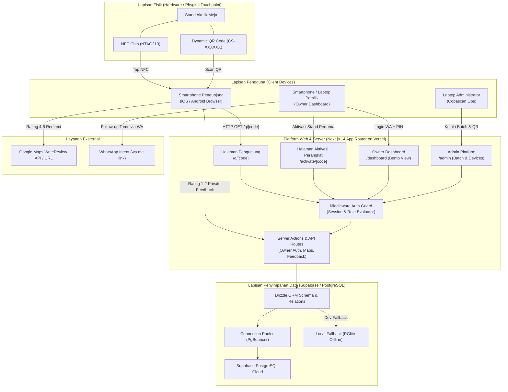

# Arsitektur Sistem Cobascan (System Architecture)

Diagram ini mengilustrasikan integrasi antara komponen hardware fisik (*phygital*), antarmuka web Next.js, database Supabase, dan lapisan otentikasi.

