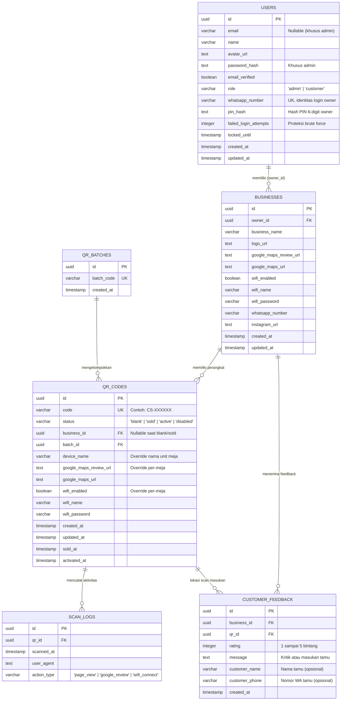

# Entity Relationship Diagram (ERD) — Cobascan Database

Diagram ini disusun berdasarkan struktur tabel dan relasi aktual pada file `lib/db/schema.js`.

```mermaid
erDiagram
    USERS ||--o{ BUSINESSES : "memiliki (owner_id)"
    USERS {
        uuid id PK
        varchar email "Nullable (khusus admin)"
        varchar name
        text avatar_url
        text password_hash "Khusus admin"
        boolean email_verified
        varchar role "'admin' | 'customer'"
        varchar whatsapp_number "UK, identitas login owner"
        text pin_hash "Hash PIN 6-digit owner"
        integer failed_login_attempts "Proteksi brute force"
        timestamp locked_until
        timestamp created_at
        timestamp updated_at
    }

    BUSINESSES ||--o{ QR_CODES : "memiliki perangkat"
    BUSINESSES ||--o{ CUSTOMER_FEEDBACK : "menerima feedback"
    BUSINESSES {
        uuid id PK
        uuid owner_id FK
        varchar business_name
        text logo_url
        text google_maps_review_url
        text google_maps_url
        boolean wifi_enabled
        varchar wifi_name
        varchar wifi_password
        varchar whatsapp_number
        text instagram_url
        timestamp created_at
        timestamp updated_at
    }

    QR_BATCHES ||--o{ QR_CODES : "mengelompokkan"
    QR_BATCHES {
        uuid id PK
        varchar batch_code UK
        timestamp created_at
    }

    QR_CODES ||--o{ SCAN_LOGS : "mencatat aktivitas"
    QR_CODES ||--o{ CUSTOMER_FEEDBACK : "lokasi scan masukan"
    QR_CODES {
        uuid id PK
        varchar code UK "Contoh: CS-XXXXXX"
        varchar status "'blank' | 'sold' | 'active' | 'disabled'"
        uuid business_id FK "Nullable saat blank/sold"
        uuid batch_id FK
        varchar device_name "Override nama unit meja"
        text google_maps_review_url "Override per-meja"
        text google_maps_url
        boolean wifi_enabled "Override per-meja"
        varchar wifi_name
        varchar wifi_password
        timestamp created_at
        timestamp updated_at
        timestamp sold_at
        timestamp activated_at
    }

    SCAN_LOGS {
        uuid id PK
        uuid qr_id FK
        timestamp scanned_at
        text user_agent
        varchar action_type "'page_view' | 'google_review' | 'wifi_connect'"
    }

    CUSTOMER_FEEDBACK {
        uuid id PK
        uuid business_id FK
        uuid qr_id FK
        integer rating "1 sampai 5 bintang"
        text message "Kritik atau masukan tamu"
        varchar customer_name "Nama tamu (opsional)"
        varchar customer_phone "Nomor WA tamu (opsional)"
        timestamp created_at
    }
```
