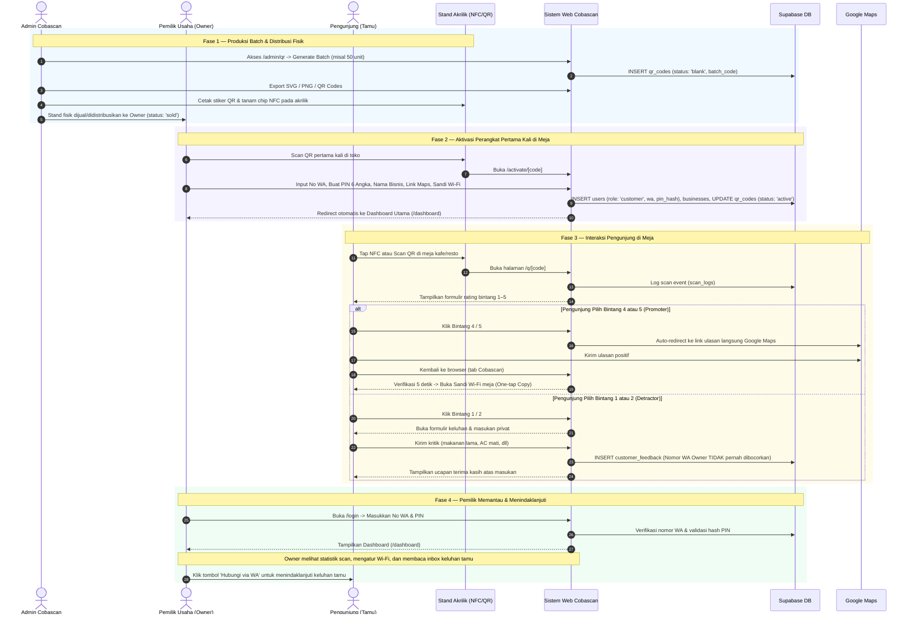

# Alur Pengguna dan Siklus Operasional Cobascan (User Journey & Lifecycle)

Diagram ini mengilustrasikan alur interaksi dari tiga aktor utama: Administrator, Pemilik Bisnis (Owner), dan Pengunjung (Visitor).

